# ECA Analysis Toolbox - Technical Reference

## [Open the hosted ECA web app](https://arkenmap-com.github.io/ECA/)

**Equivalent Clearcut Area (ECA) Analysis for ArcGIS Pro**
Authors: Eric Hoodicoff, Moez Labiadh (BCTS Kootenay Business Area)
Refactored for ArcGIS Pro: 2026

---

## Open-source draft workflow

The legacy ArcGIS toolbox remains below as the validation reference. The
ArcPy-free draft implementation is in `open_eca/`: it acquires catalogue data
to a local GeoPackage, calculates the watershed/H60/opening/recovery workflow,
and writes `ECA_Draft.gpkg` plus CSV and HTML reports. See
[`open_eca/README.md`](open_eca/README.md) for the command-line and QGIS
Processing-tool instructions.

---

## Table of Contents

1. [What is ECA and Why It Matters](#1-what-is-eca-and-why-it-matters)
2. [Architecture Overview](#2-architecture-overview)
3. [Tool Parameters](#3-tool-parameters)
4. [Complete Processing Pipeline](#4-complete-processing-pipeline)
5. [Watershed and Subbasin Setup](#5-watershed-and-subbasin-setup)
6. [DEM and Elevation Analysis](#6-dem-and-elevation-analysis)
7. [Layer Configuration System](#7-layer-configuration-system)
8. [Transport Layer Processing](#8-transport-layer-processing)
9. [Opening Layer Assembly](#9-opening-layer-assembly)
10. [Other Openings and Pest Layer](#10-other-openings-and-pest-layer)
11. [Spatial Splitting Operations](#11-spatial-splitting-operations)
12. [Recovery Curve Algorithm](#12-recovery-curve-algorithm)
13. [Report Generation](#13-report-generation)
14. [Output GDB Structure](#14-output-gdb-structure)
15. [Module Reference](#15-module-reference)

---

## 1. What is ECA and Why It Matters

### The Concept

**Equivalent Clearcut Area (ECA)** is a hydrological metric that quantifies how much of a watershed behaves as if it were completely clearcut, even though some areas may have partially regrown. It answers the question: *"Given all the harvesting, roads, and natural disturbances in this watershed, how much of the land is effectively bare from a snowmelt and runoff perspective?"*

### Why It Matters

When forests are removed (by harvesting, fire, pest, or roads), three hydrological changes occur:

1. **More snow accumulates** on open ground (no canopy interception)
2. **Snow melts faster** (direct sunlight, no shade from trees)
3. **More water reaches streams** (no tree root uptake, no canopy evaporation)

In watersheds with high ECA percentages, the increased runoff can cause:
- Peak flow increases leading to flooding
- Channel erosion and sedimentation
- Damage to fish habitat and infrastructure

BC's Interior Watershed Assessment Procedure uses ECA thresholds to flag watersheds at risk. A watershed with an ECA of 25-30% or higher is generally considered to have elevated hydrological risk.

### The H60 Line

The **H60 line** is the **40th percentile elevation** of valid DEM cells inside the watershed: approximately 60% of the sampled watershed area lies above it and 40% below it.

```
GIS Terms: The H60 line divides the watershed into two hydrological zones:
  - "H60 Above" (upper 60%) - the snow accumulation zone where snowpack is deeper
    and persists longer. Disturbances here have the greatest impact on peak flows
    because they release the most stored water during spring melt.
  - "H60 Below" (lower 40%) - the rain-dominated or transient snow zone. Disturbances
    here still matter but have less impact on the synchronous spring melt pulse.

Script Terms: dem.py calculates the 40th percentile using NumPy on a raster array,
  draws a contour at that elevation, and reclassifies the DEM into two polygon
  zones ("H60 Above" / "H60 Below").
```

The web app automatically acquires the open 30 m NRCan Medium Resolution
Digital Elevation Model terrain product for the selected watershed. It records
the exact source asset and checksum for reproducibility. Analysts may override
the automatic source with a georeferenced GeoTIFF or explicitly run without an
H60 split.

### The ECA Formula

```
ECA = Opening Area x (1 - Recovery%)
```

| Scenario | Area (ha) | Recovery % | ECA (ha) | Meaning |
|---|---|---|---|---|
| Fresh clearcut | 10 | 0% | 10.0 | Fully equivalent to bare ground |
| Partial regrowth | 10 | 50% | 5.0 | Half recovered, half still "clearcut" |
| Mature second growth | 10 | 100% | 0.0 | Fully recovered, no hydrological impact |

### The Two-Tool Workflow

This toolbox uses a **two-pass workflow** to balance automation with human expertise:


1. **ECA Estimate** -- Automated first pass. Clips all source layers, assembles openings, calculates recovery. Produces a "draft" analysis for human review.
2. **Manual Review** -- The analyst inspects the Openings feature class in ArcGIS Pro. They fix mis-classified polygons, adjust crown closure/height values, and set Override recovery values where the automated curve is wrong.
3. **ECA Final** -- Uses the reviewed Openings from the Estimate GDB. Recalculates recovery (honoring overrides), generates aspect/slope rasters, and produces the final reports.

---

## 2. Architecture Overview

### Module Dependency Graph

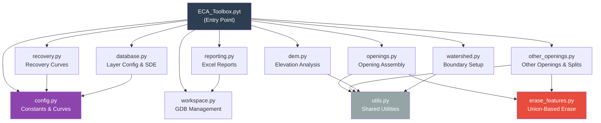

### Spreadsheet-Driven Architecture

Unlike traditional ArcGIS toolboxes that hardcode layer paths, this toolbox reads all input layer definitions from a single Excel spreadsheet (`TKO_ECA_Input_Layers.xlsx`). This means:

- Adding a new data layer requires **zero code changes** -- just add a row to the spreadsheet
- Changing a database connection or definition query is a spreadsheet edit
- The same toolbox code works across different regions if the spreadsheet is updated

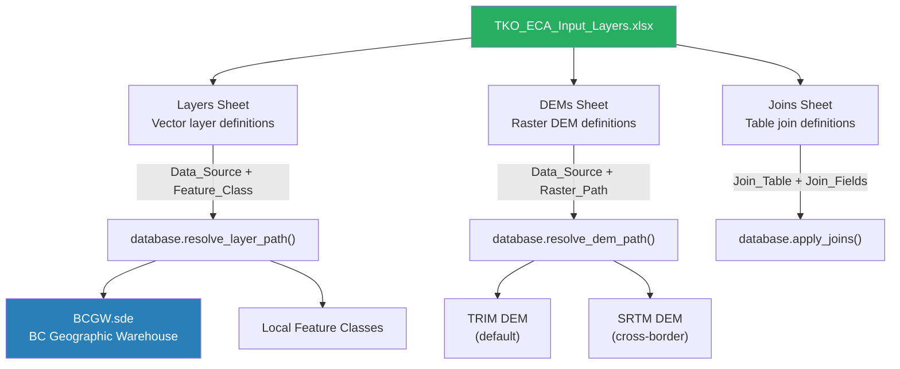

### Hot-Reload Development Pattern

The toolbox uses `importlib.reload()` to reload all core modules every time a tool runs. This means developers can edit any `.py` file in the `core/` directory and the changes take effect immediately on the next tool run -- without restarting ArcGIS Pro.

```python
# In ECA_Toolbox.pyt
def _reload_modules():
    importlib.reload(core.config)
    importlib.reload(core.utils)
    importlib.reload(core.erase_features)
    # ... all 10 core modules
```

```
Script: _reload_modules() is called at the top of every execute() method.
        importlib.reload() re-reads the .py source file and re-executes it,
        replacing the cached module object.

GIS Terms: This is a development convenience. Normally when you add a Python
           toolbox to ArcGIS Pro, module changes are cached and you'd need to
           restart Pro to pick them up. The hot-reload pattern eliminates this.
```

---

## 3. Tool Parameters

Both tools share a common parameter set built by `_build_parameters()` in `ECA_Toolbox.pyt`. The Final tool adds one additional parameter.

| # | Parameter | Data Type | Description (GIS) | Description (Script) |
|---|---|---|---|---|
| 0 | Input Watershed (Subbasins) | GPFeatureLayer (Polygon) | A polygon feature layer where each polygon is a sub-basin of the watershed you want to analyze. Must have fields for basin name and sub-basin name. | Passed as `parameters[0].valueAsText`. Used by `watershed.setup_watershed()` to dissolve into a single boundary and `setup_subbasins()` to copy as Sub_Basins. |
| 1 | Basin Name Field | Field | The attribute field containing the watershed name (e.g., "Moyie River"). All sub-basin polygons must share the same value in this field. | Used as the dissolve field. The tool validates exactly 1 unique value after dissolve. |
| 2 | Sub-Basin Name Field | Field | The attribute field containing individual sub-basin names (e.g., "Upper Moyie", "Lower Moyie"). Can be the same as the basin field if no sub-basins exist. | If basin_field == subbasin_field, values are copied. Null/blank sub-basin values are filled with the watershed name. |
| 3 | Output Folder | DEFolder | The directory where all output files will be created (GDB, reports, scratch). | Used to create `ECA_Estimate.gdb`, `EstECAscratch.gdb`, and `EstimateOutputs/` (or Final equivalents). |
| 4 | Layer Configuration Spreadsheet | DEFile (.xlsx) | The Excel file that defines all input layers, DEMs, and joins. Defaults to the template in the toolbox directory. | Read by `database.load_layer_config()`. Returns 3 lists: vector_layers, dem_layers, joins. |
| 5 | Estimate Output GDB | DEWorkspace | **Final tool only.** The geodatabase from the Estimate run that contains the manually reviewed Openings feature class. | Used to read `Openings`, `OtherOpenings`, `PestInfestation`, etc. from the Estimate pass. |

### Data Sources Explained

| Source | Full Name | Contains | Connection |
|---|---|---|---|
| **BCGW** | BC Geographic Warehouse | VRI (vegetation), Results (silviculture), BEC zones, roads (DRA), pest surveys, wildfire history, US/Canada border | Enterprise SDE via `BCGW.sde` |
| **LOCAL** | Local Feature Classes | Field team boundaries, any locally maintained layers | Direct file paths |

---

## 4. Complete Processing Pipeline

### Estimate Tool Pipeline

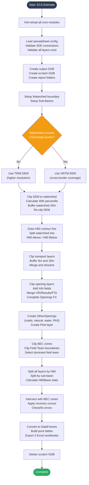

### Final Tool Pipeline

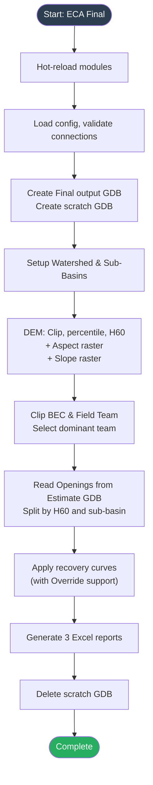

### Estimate vs. Final Comparison

| Aspect | Estimate Tool | Final Tool |
|---|---|---|
| **Purpose** | Automated first pass | Refined final analysis |
| **Opening source** | Clips and assembles from BCGW/LOCAL | Reads reviewed Openings from Estimate GDB |
| **Transport processing** | Full clip/buffer/merge pipeline | Skipped (uses Estimate data) |
| **VRI/Results/FTA merge** | Performed | Skipped |
| **Aspect raster** | Not calculated | Calculated and saved to GDB |
| **Slope raster** | Not calculated | Calculated and saved to GDB |
| **Recovery Override** | Not supported (Override = -1) | Supported (analyst can set any value) |
| **Output GDB name** | `ECA_Estimate.gdb` | `ECA_Final.gdb` |
| **Report folder** | `EstimateOutputs/` | `Final_Outputs/` |
| **When to run** | First, before any manual review | After reviewing Estimate results |

---

## 5. Watershed and Subbasin Setup

**Module:** `core/watershed.py`

### What Happens

The first processing step takes the user's input subbasin polygons and produces two standardized feature classes: a single dissolved watershed boundary and a copy of the sub-basins with standardized field names.

### setup_watershed()

```
Script: watershed.setup_watershed(input_watershed, basin_field, output_gdb)
  1. Dissolves all input polygons using basin_field
  2. Validates exactly 1 feature results (error if 0 or >1)
  3. Renames basin_field to standardized "Watershed"
  4. Copies to output_gdb/Watershed_Boundary
  5. Returns (basin_name, basin_area_hectares)

GIS Terms: The Dissolve tool merges all sub-basin polygons that share the same
  watershed name into a single polygon boundary. This boundary is used for all
  subsequent clipping operations -- every data layer gets clipped to this shape.

  If the dissolve produces more than one feature, it means your sub-basin data
  contains multiple different watershed names, which is an error.
```

### setup_subbasins()

```
Script: watershed.setup_subbasins(input_watershed, basin_field, subbasin_field, output_gdb)
  1. Copies input features to output_gdb/Sub_Basins
  2. Renames basin_field -> "Watershed", subbasin_field -> "Sub_Basin"
  3. If basin_field == subbasin_field, copies watershed name to Sub_Basin
  4. Fills null/blank Sub_Basin values with the watershed name
  5. Adds SubBasinArea field (geodesic hectares from geometry)

GIS Terms: Sub-basins are the individual drainage units within the watershed.
  Each sub-basin will get its own sheet in the final reports, with ECA calculated
  independently for each.
```

### Example

```
Input: 4 polygons with attributes:
  | WSHED_NAME    | SUB_BASIN_NAME |
  |---------------|----------------|
  | Moyie River   | Upper Moyie    |
  | Moyie River   | Lower Moyie    |
  | Moyie River   | East Fork      |
  | Moyie River   | West Fork      |

After setup_watershed():
  -> Watershed_Boundary: 1 dissolved polygon, basin_name="Moyie River"

After setup_subbasins():
  -> Sub_Basins: 4 polygons with fields:
     | Watershed   | Sub_Basin    | SubBasinArea |
     |-------------|--------------|--------------|
     | Moyie River | Upper Moyie  | 1250.5       |
     | Moyie River | Lower Moyie  | 890.2        |
     | Moyie River | East Fork    | 620.8        |
     | Moyie River | West Fork    | 445.1        |
```

---

## 6. DEM and Elevation Analysis

**Module:** `core/dem.py`

### Processing Flow

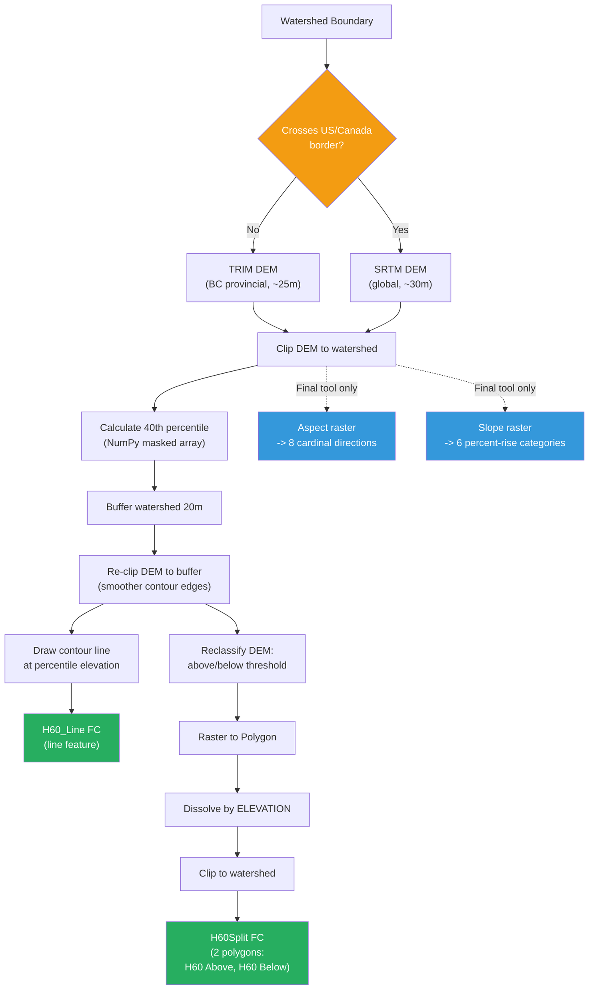

### Step 1: US/Canada Border Check

```
Script: dem.check_border(watershed_path, us_border_path)
  - Creates feature layers for both inputs
  - Uses SelectLayerByLocation with "CROSSED_BY_THE_OUTLINE_OF"
  - If selection count == 0: returns "default" (TRIM DEM)
  - If selection count > 0: returns "cross_border" (SRTM DEM)

GIS Terms: Watersheds near the US border (e.g., in the Boundary field team area)
  may extend across the international boundary. BC's TRIM DEM only covers BC,
  so for cross-border watersheds the tool switches to the globally available
  SRTM (Shuttle Radar Topography Mission) DEM which has slightly lower resolution
  but covers both sides of the border.
```

### Step 2: DEM Clip and Percentile Calculation

```
Script: dem.calc_percentile(dem, output_folder, percentile=40)
  1. Converts DEM to integer (Int() from arcpy.sa)
  2. Saves temp integer DEM to disk (needed for large rasters)
  3. Converts to NumPy array: arcpy.RasterToNumPyArray(dem_int_path, nodata_to_value=-999)
  4. Creates masked array: np.ma.masked_values(dem_arr, -999)
  5. Calculates: np.percentile(masked.compressed(), 40)
  6. Returns elevation value as float

GIS Terms: Every cell in the DEM has an elevation value. We take ALL elevation
  values in the watershed, sort them from lowest to highest, and find the value
  at the 40th percentile mark. This is the H60 line elevation.

  Example: If your watershed ranges from 800m to 2200m elevation, and the 40th
  percentile is 1320m, then 40% of the watershed's area is below 1320m and 60%
  is above it.
```

### Step 3: Buffer and Re-clip

```
Script: dem.buffer_watershed(watershed, buffer_distance=20)
  - Buffers watershed by 20m
  - Used to re-clip the DEM before contour generation

GIS Terms: The 20m buffer ensures the contour line extends slightly beyond the
  watershed boundary before being clipped back. Without this, contour lines
  that run along the watershed edge can have jagged artifacts or gaps. The buffer
  creates a "bleed zone" that produces smoother contour geometry at the boundary.
```

### Step 4: H60 Contour Line

```
Script: dem.draw_contour_line(dem, elevation, watershed, output_gdb)
  1. arcpy.ddd.ContourList() creates contour at the exact elevation
  2. arcpy.analysis.Clip() clips contour to watershed boundary
  3. Saves as H60_Line in output GDB

GIS Terms: This is the actual H60 line drawn on the map -- a line feature class
  showing where the 40th percentile elevation crosses the landscape. Think of it
  as drawing a horizontal line on a topographic map at exactly 1320m (or whatever
  the calculated elevation is).
```

### Step 5: H60 Split

```
Script: dem.split_h60(watershed, dem, elevation, output_gdb, basin_area)
  1. Adds ELEVATION text field to the DEM raster
  2. Uses CalculateField with a Python code block:
     def elev(v):
         if v <= elevation: return 'H60 Below'
         else: return 'H60 Above'
  3. RasterToPolygon converts classified raster to polygons
  4. Dissolve by ELEVATION field -> 2 polygons
  5. Clip to watershed
  6. Adds H60Area field (hectares)
  7. Deletes the classified DEM

GIS Terms: This takes the DEM and paints every cell either "Above" or "Below"
  the H60 elevation. Then it converts this painted raster into two polygon
  shapes. The result is a feature class with exactly 2 records:
  - "H60 Above" polygon covering the upper 60% of the watershed
  - "H60 Below" polygon covering the lower 40%

  These two polygons are used later to split every opening into its above/below
  components, because disturbances above the H60 line have greater hydrological
  impact than those below.
```

### Aspect Analysis (Final Tool Only)

```
Script: dem.calc_aspect(dem, output_gdb, output_folder)
  1. Aspect() from arcpy.sa calculates aspect in degrees (0-360)
  2. Multiply by 10 to preserve decimal precision before integer truncation
  3. Int() truncates to integer
  4. Reclassify using ASPECT_REMAP:
     - -10 to -1  -> 0 (Flat)
     - 0 to 22.5  -> 1 (North)
     - 22.5-67.5  -> 2 (Northeast)
     - 67.5-112.5 -> 3 (East)
     - 112.5-157.5 -> 4 (Southeast)
     - 157.5-202.5 -> 5 (South)
     - 202.5-247.5 -> 6 (Southwest)
     - 247.5-292.5 -> 7 (West)
     - 292.5-337.5 -> 8 (Northwest)
     - 337.5-360   -> 1 (North, wraps around)
  5. RasterToPolygon, Dissolve by direction, CopyFeatures to output GDB
  6. Adds Area (hectares) field

GIS Terms: Aspect is the compass direction a slope faces. A south-facing slope
  (aspect ~180 degrees) receives more direct sunlight and melts snow faster than a
  north-facing slope. This information helps hydrologists understand snowmelt
  dynamics across the watershed. The reclassification groups the 360-degree
  continuous aspect into 8 cardinal direction classes plus flat terrain.

  The multiply-by-10 trick: Aspect values like 22.5 degrees would be truncated
  to 22 when converting to integer, but 225 (22.5 x 10) preserves the precision
  needed for accurate reclassification boundaries.
```

### Slope Analysis (Final Tool Only)

```
Script: dem.calc_slope(dem, output_gdb, output_folder)
  1. Slope() with PERCENT_RISE output measurement
  2. Int() truncates to integer
  3. Reclassify using SLOPE_REMAP:
     - 0-20%    -> "0-20%"
     - 21-40%   -> "21-40%"
     - 41-60%   -> "41-60%"
     - 61-80%   -> "61-80%"
     - 81-100%  -> "81-100%"
     - 101%+    -> "101%+"
  4. RasterToPolygon, Dissolve, CopyFeatures to output GDB
  5. Adds Area (hectares) field

GIS Terms: Slope steepness affects how quickly water runs off the land. Steep
  slopes (>60%) generate rapid runoff and are more prone to erosion when
  vegetation is removed. The slope analysis categorizes terrain steepness
  across the watershed. Percent rise means: for every 100m horizontal distance,
  how many meters does the elevation change? A 100% slope rises 1m for every
  1m of horizontal distance (i.e., a 45-degree angle).
```

---

## 7. Layer Configuration System

**Module:** `core/database.py`

### Spreadsheet Structure

The entire toolbox is driven by `TKO_ECA_Input_Layers.xlsx`, which contains three sheets:

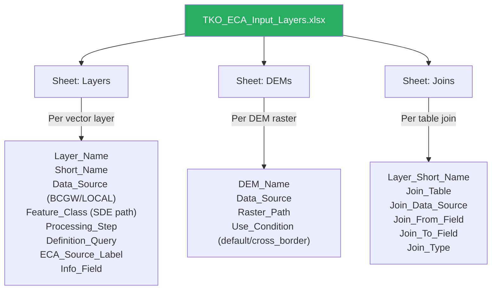

### Processing_Step Categories

Each vector layer is assigned a `Processing_Step` that determines when and how it is processed:

| Processing_Step | Meaning | Examples |
|---|---|---|
| `transport_8` | Road/rail/pipeline layers buffered at **8m** width (4m half-width) | Minor DRA roads |
| `transport_18` | Road/rail/pipeline layers buffered at **18m** width (9m half-width) | Major DRA roads, pipelines, railways |
| `opening` | Forest opening layers (harvested, burned, urban) | VRI Openings & Burns, Results, FTA Pending Blocks |
| `other` | Non-forest opening layers tracked separately | VRI Natural Openings, VRI Water, Results PAS, Private Lands, Wildfire 20+ Years |
| `pest` | Pest infestation data | Current Pest Infestation, Historic Pest Infestation |
| `reference` | Reference layers not clipped into openings | BEC Zones, Field Team boundaries, US/Canada Border |

### How Layer Paths Are Resolved

```
Script: database.resolve_layer_path(row, connections)
  1. Reads Data_Source from the row (e.g., "BCGW")
  2. Reads Feature_Class from the row (e.g., "WHSE_FOREST_VEGETATION.VEG_COMP_LYR_R1_POLY")
  3. Looks up the SDE connection: connections["BCGW"] = "Database Connections\BCGW.sde"
  4. Returns: "Database Connections\BCGW.sde\WHSE_FOREST_VEGETATION.VEG_COMP_LYR_R1_POLY"

GIS Terms: SDE (Spatial Database Engine) connection files (.sde) are how ArcGIS
  connects to enterprise geodatabases. The path "BCGW.sde\WHSE_FOREST..." tells
  ArcGIS to connect to the BC Geographic Warehouse server and query the specified
  feature class. This is the same as adding a layer from a database connection
  in ArcGIS Pro's Catalog pane.
```

### Join System

Some layers need additional attributes from related tables before they can be processed. The Joins sheet defines these relationships.

```
Script: database.apply_joins(feature_layer, joins_for_layer, connections)
  For each join definition:
  1. Resolves the join table path from Data_Source + Join_Table
  2. Calls arcpy.management.AddJoin() with:
     - in_layer = the feature layer
     - in_field = Join_From_Field (field in the feature layer)
     - join_table = resolved path
     - join_field = Join_To_Field (field in the join table)
     - join_type = Join_Type (KEEP_ALL or KEEP_COMMON)

GIS Terms: A table join attaches attributes from a related table to a feature
  layer using a shared key field so the analysis can select or report on
  attributes that are not stored directly in the spatial feature class.
```

### Example Spreadsheet Row Walkthrough

```
Layer_Name:       "VRI Openings and Burns"
Short_Name:       "VRIOpeningsandBurns"
Data_Source:       "BCGW"
Feature_Class:     "WHSE_FOREST_VEGETATION.VEG_COMP_LYR_R1_POLY"
Processing_Step:   "opening"
Definition_Query:  "NON_PRODUCTIVE_DESCRIPTOR_CD IS NOT NULL OR ..."
ECA_Source_Label:  "VRI Openings and Burns"
Companion_Layer:   (empty)
Info_Field:        "NON_PRODUCTIVE_DESCRIPTOR_CD"

Processing:
1. resolve_layer_path() builds: "BCGW.sde\WHSE_FOREST_VEGETATION.VEG_COMP_LYR_R1_POLY"
2. MakeFeatureLayer creates a temporary layer from this SDE path
3. SelectLayerByAttribute applies the Definition_Query to filter records
4. SelectLayerByLocation selects only features intersecting the watershed
5. CopyFeatures + Clip produces "Clip_VRIOpeningsandBurns" in scratch GDB
6. ECAsrc field is set to "VRI Openings and Burns"
7. Info field is populated from NON_PRODUCTIVE_DESCRIPTOR_CD
```

---

## 8. Transport Layer Processing

**Module:** `core/openings.py` (transport functions)

### Why Roads Matter for ECA

Roads, railways, and pipelines are permanently cleared corridors. Unlike forest openings that recover over time, road surfaces remain at 0% recovery. They contribute directly to ECA in two ways:

1. **Direct surface runoff** from compacted road surfaces
2. **Ditch drainage** that intercepts subsurface water flow and routes it to streams faster

The toolbox buffers road centerlines to approximate their actual cleared width.

### Processing Pipeline

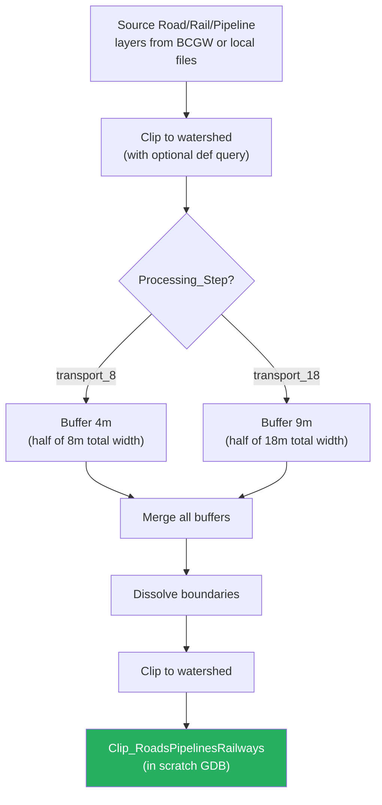

### Buffer Widths

```
Script: openings.buffer_transport(list_list, scratch_gdb)
  - buffer_distances = [4, 9]  # half-widths
  - arcpy.analysis.Buffer(layer, output, distance, "FULL", "ROUND", "ALL")
    "FULL" = buffer on both sides
    "ROUND" = rounded end caps
    "ALL" = dissolve all buffers into one shape

GIS Terms: Road centerlines are drawn as single lines. To represent their actual
  cleared area, we buffer them:
  - 8m roads (minor forest roads): 4m buffer on each side = 8m total cleared width
  - 18m roads (major highways, railways, pipelines): 9m buffer on each side = 18m

  The Dissolve step merges all overlapping road buffers into a single polygon so
  road intersections aren't double-counted.
```

### DRA Road Copy

After transport processing, the DRA (Digital Road Atlas) major and minor roads are also copied to the output GDB as `Roads_DRA` for reference mapping purposes. This is separate from the buffered transport polygons used in the ECA calculation.

---

## 9. Opening Layer Assembly

**Module:** `core/openings.py` (opening functions)

This is the most complex part of the toolbox. It assembles the main "Openings" feature class from multiple overlapping data sources, resolving conflicts and tracking the source of each polygon.

### Clip Opening Layers

```
Script: openings.clip_opening_layers(layer_configs, connections, watershed, scratch_gdb, output_gdb, joins)
  For each layer:
  1. Make feature layer from SDE source
  2. Apply table joins if defined
  3. Apply definition query (if any) via SelectLayerByAttribute
  4. Select features intersecting watershed via SelectLayerByLocation
  5. CopyFeatures to memory, then Clip to watershed boundary
  6. Add source tracking field:
     - ECAsrc for layers in LAYERS_WITH_ECA_SRC set
     - ECAsrc_1 for all other layers (renamed later)
  7. Copy Private Lands and Wildfire 20+ Years to output GDB
  8. Return list of layer names not in CLIP_LAYERS_REMOVE

GIS Terms: Each data source is clipped to the watershed boundary, keeping only
  the parts that fall inside. The two-step approach (select by location, then clip)
  is more efficient than a direct clip on a large SDE dataset -- the selection
  reduces the number of features before the computationally expensive clip.
```

### VRI / Results / FTA Merge

This is the core opening assembly logic. Three overlapping data sources must be merged without double-counting:

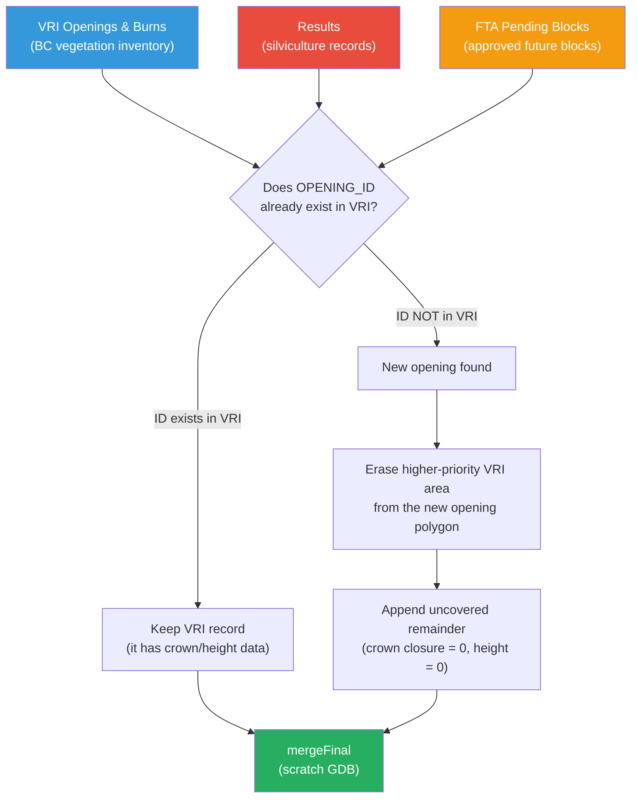

```
Script: openings.merge_vri_results_fta(scratch_gdb)
  1. Start with VRI as the base layer (it has the best crown/height data)
  2. For Results and FTA, in order:
     a. Add zero crown closure and height fields (ECAcrown=0, ECAheight=0)
     b. Rename OPENING_ID -> temp_ID (prevents field conflicts during append)
     c. Rename Info -> inftmp
     d. Get all OPENING_IDs from current merged layer (SearchCursor)
     e. Find non-matching IDs in Results/FTA
     f. For non-matching records only:
        - Select them from Results/FTA
        - Erase the higher-priority VRI/Results footprint from their geometry
        - Build FieldMappings to align temp_ID->OPENING_ID, ECAcrown->CROWN_CLOSURE, etc.
        - Append to the erased VRI layer
  3. Copy final result to scratch_gdb/mergeFinal

GIS Terms: The three data sources overlap in space:
  - VRI (Vegetation Resources Inventory) is the primary provincial inventory,
    updated periodically. It has crown closure and projected height values.
  - Results are silviculture records -- they track what was actually planted/treated
    after harvesting. They may have more current geometry than VRI.
  - FTA (Forest Tenure Act) pending blocks are approved but not yet harvested.

  The merge logic always gives VRI spatial precedence over Results/FTA because
  VRI has crown closure and height measurements. Results can fill only area
  outside VRI, and FTA can fill only area outside both VRI and Results. New
  remainder polygons are added with crown=0 and height=0 (fully clearcut
  equivalent).
```

### Complete Openings Assembly

```
Script: openings.complete_openings(layer_list, scratch_gdb, output_gdb)
  1. Start with the VRI/Results/FTA merge as the highest-priority base.
  2. Add Consolidated Cut Blocks only where they do not overlap the base.
  3. Add wildfire layers only where they do not overlap the base or
     Consolidated Cut Blocks.
  4. Process any unclassified generic layers using the legacy incoming-layer
     precedence behavior.
  5. Erase VRI Natural Openings overlap
  6. Copy to output_gdb/Openings
  7. Add Override field (for Final tool) and Hectares
  8. Calculate Hectares

GIS Terms: The main opening priority is:

  VRI/Results/FTA > Consolidated Cut Blocks > Wildfire

Consolidated Cut Blocks and wildfire are clipped against the already-built
higher-priority openings before appending, so they cannot overwrite them or
double-count their area. VRI Water is handled by create_other_openings() and
is not appended to the main Openings feature class.
```

### The EraseFeatures Workaround

```
Script: erase_features.EraseFeatures(in_features, erase_features, out_features)
  1. Union in_features with erase_features
  2. Rows where FID_erase_features == -1 are the parts OUTSIDE the erase zone
  3. Delete rows where FID != -1 (these are inside the erase zone)
  4. Delete extra fields created by Union
  5. Copy result to output

GIS Terms: The standard Erase tool requires an ArcGIS Advanced license. This
  workaround uses the Union tool (available at all license levels) to achieve
  the same result. Union splits polygons at every intersection, and the FID
  field tells you which original feature each piece came from. By keeping only
  pieces with FID_erase=-1 (meaning they don't overlap the erase layer), we
  get the same result as Erase.
```

### ECAsrc Field Tracking

Every opening polygon carries an `ECAsrc` (ECA Source) field that records which data layer it came from. This flows through to the final reports so analysts can see the breakdown of ECA by source.

| ECAsrc Value | Meaning |
|---|---|
| VRI Openings and Burns | From the provincial vegetation inventory |
| Results | From silviculture results (RESULTS layer) |
| FTA Pending Blocks | Approved future harvest blocks |
| Wildfire 20+ Years | Historic wildfire areas (20+ year old burns) |
| Roads, Railways, Pipelines | Buffered transport corridors |
| VRI Natural Openings | Naturally non-forested areas (rock, alpine, etc.) |
| VRI Water | Lakes, rivers, wetlands |
| Results PAS | Post-Activity Silviculture (regeneration areas) |
| Pest Infestation | Insect/disease affected areas |

---

## 10. Other Openings and Pest Layer

**Module:** `core/other_openings.py`

### Why Track These Separately?

"Other Openings" are non-forest areas that don't have recovery potential in the same way as harvested openings. Roads never grow back. Lakes don't recover. Natural alpine areas were never forested. These are tracked in a separate feature class and report because they represent a permanent baseline of non-forested area, distinct from the harvestable/recoverable openings.

### Priority-Based Erasure Chain

Each layer is erased from previously processed layers to prevent double-counting:

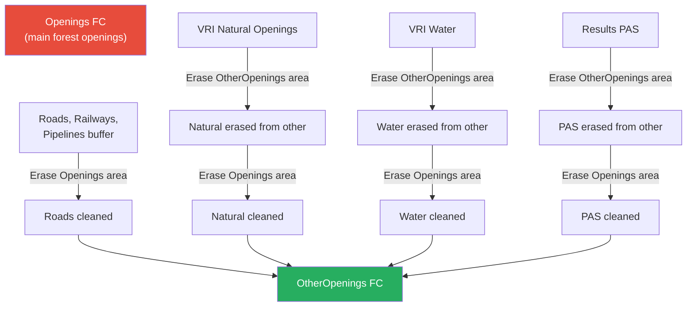

```
Script: other_openings.create_other_openings(scratch_gdb, output_gdb)
  Processing order (highest to lowest priority):
  1. Roads/Railways/Pipelines - erased from Openings
  2. VRI Natural Openings - erased from OtherOpenings AND Openings
  3. VRI Water - erased from OtherOpenings AND Openings
  4. Results PAS - erased from OtherOpenings AND Openings

  Each layer is added using _add_to_other() which CopyFeatures on first call
  and ez_append on subsequent calls.

  If no layers exist at all, an empty polygon FC is created.

GIS Terms: The dual erasure (erase from OtherOpenings AND from Openings) ensures
  that:
  1. No area is counted in BOTH Openings and OtherOpenings
  2. No area is counted twice within OtherOpenings

  The priority order means roads "win" over natural openings -- if a road runs
  through a natural meadow, the road area is attributed to "Roads" not "Natural
  Openings". This is important for understanding the human vs. natural disturbance
  footprint.
```

### Pest Layer

```
Script: other_openings.create_pest_layer(scratch_gdb, output_gdb)
  1. Merge current and historic pest infestation data
  2. Set ECAsrc = "Pest Infestation"
  3. If neither layer exists, create empty FC

GIS Terms: Pest data (Mountain Pine Beetle, Spruce Bark Beetle, etc.) is tracked
  separately from forest openings because pest-damaged forests don't behave the
  same way as clearcuts. Trees may still be standing (providing some canopy
  interception) even though they're dead. The pest report provides additional
  context for watershed health assessment.

  Pest data includes capture year, severity code, and species information from
  the provincial aerial overview surveys.
```

---

## 11. Spatial Splitting Operations

**Module:** `core/other_openings.py` (split functions)

### Two-Step Intersection

Every opening must be classified by both elevation zone (H60 Above/Below) and sub-basin. This is done through two sequential intersection operations:

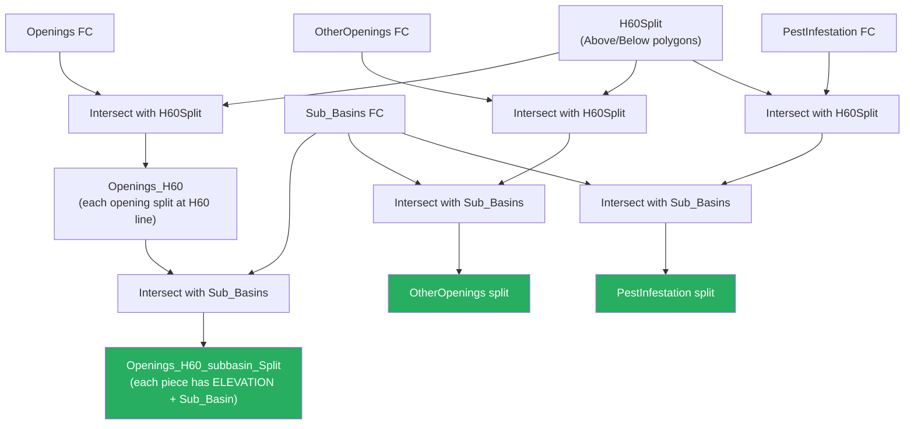

```
Script: other_openings.split_by_h60(layer_names, layer_sources, h60_split_path)
  For each layer:
  1. arcpy.analysis.Intersect([source, h60_split_path], output, "NO_FID")
  2. Result contains ELEVATION field from H60Split ("H60 Above" or "H60 Below")
  Returns dict of {name: h60_split_path}

  other_openings.split_by_subbasin(h60_splits, basin_area, subbasins_path, output_gdb)
  For each H60-split layer:
  1. arcpy.analysis.Intersect([h60_layer, subbasins_path], output, "NO_FID")
  2. Result contains both ELEVATION and Sub_Basin fields
  3. _write_split() replaces the output GDB feature class with the split version
  4. Recalculates Hectares and adds BasinArea field

GIS Terms: Imagine an opening polygon that spans the H60 elevation line and crosses
  into two sub-basins. After the two intersections, that single polygon becomes
  up to 4 pieces:

  Original 10 ha opening:
  +-----------+-----------+
  | H60 Above | H60 Above |
  | Sub A     | Sub B     |
  | 3.2 ha    | 1.8 ha    |
  +-----------+-----------+
  | H60 Below | H60 Below |
  | Sub A     | Sub B     |
  | 2.5 ha    | 2.5 ha    |
  +-----------+-----------+

  Each piece retains all the original attributes (crown closure, height, source
  layer) plus gains ELEVATION and Sub_Basin fields. This enables the reports to
  calculate ECA independently for each sub-basin and elevation zone.
```

### H60 Basin Statistics

```
Script: other_openings.calc_subbasin_h60(output_gdb)
  1. Union H60Split with Sub_Basins
  2. Calculate H60BsnArea (hectares) for each piece
  3. Calculate percent = H60BsnArea / SubBasinArea * 100
  4. Clean up FID fields from Union
  5. Write to H60Basin FC

GIS Terms: This creates a reference table showing what percentage of each sub-basin
  is above vs. below the H60 line. A sub-basin that is 80% above H60 has most of
  its area in the snow accumulation zone and is more sensitive to disturbance than
  one that is only 30% above H60.

  Example H60Basin output:
  | Sub_Basin    | ELEVATION  | H60BsnArea | SubBasinArea | percent |
  |--------------|------------|------------|--------------|---------|
  | Upper Moyie  | H60 Above  | 950.3      | 1250.5       | 76.0%   |
  | Upper Moyie  | H60 Below  | 300.2      | 1250.5       | 24.0%   |
  | Lower Moyie  | H60 Above  | 445.1      | 890.2        | 50.0%   |
  | Lower Moyie  | H60 Below  | 445.1      | 890.2        | 50.0%   |
```

### BEC Zone Intersection for Recovery

```
Script: other_openings.setup_curve_layer(field_team, output_gdb, scratch_gdb)
  1. Intersects BEC zones (Clip_BEC) with the H60/subbasin-split openings
  2. Adds Field_Team field (constant value for all rows)
  3. Adds Recovery field (initially empty, populated by recovery.py)
  4. Calculates Hectares
  5. Writes to Openings_BEC FC

GIS Terms: Each opening polygon now needs to be classified by its Biogeoclimatic
  Ecosystem Classification (BEC) zone. The BEC zone determines which recovery
  curve is applied -- trees grow at different rates in different ecosystems.

  A single opening that spans two BEC zones (e.g., ICH and ESSF) will be split
  into two records, each with its own zone-specific recovery calculation. This
  intersection is the final splitting step before recovery curves are applied.
```

---

## 12. Recovery Curve Algorithm

**Modules:** `core/recovery.py`, `core/config.py`

### How Recovery Is Determined

Recovery percentage depends on three factors looked up in a hierarchical table:

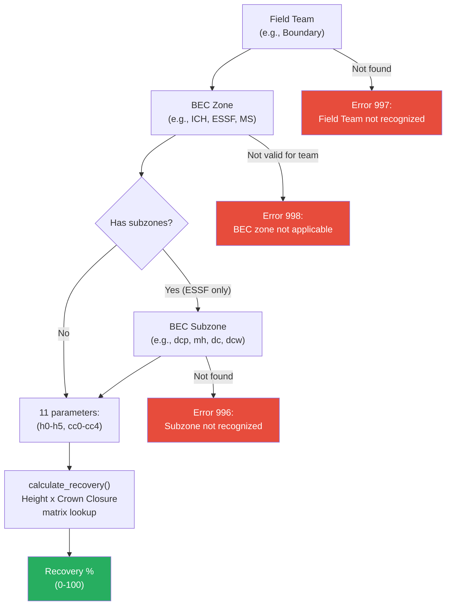

### Field Teams and BEC Zones

The BCTS Kootenay Business Area is divided into 5 field teams, each with different growth curves:

| Field Team | Supported BEC Zones | ESSF Subzones |
|---|---|---|
| **Boundary** | ICH, MS, ESSF, IDF, PP | dcp, mh, dc, dcw |
| **Arrow** | ICH, ESSF | (none -- single curve) |
| **Kootenay Lake** | ICH, ESSF | (none -- single curve) |
| **Invermere** | ICH, MS, ESSF, IDF | (none -- single curve) |
| **Cranbrook** | ICH, MS, ESSF, IDF | (none -- single curve) |

### Recovery Curve Parameters

Each field team / BEC zone combination has an 11-element tuple:

```
(h0, h1, h2, h3, h4, h5, cc0, cc1, cc2, cc3, cc4)
 |                     |  |                      |
 +-- height thresholds  +-- crown closure thresholds
     (metres)               (percent)
```

**Example: Boundary / ICH**
```
(5, 9, 11, 15, 20, 25, 15, 20, 30, 45, 55)
 h0=5m  h1=9m  h2=11m  h3=15m  h4=20m  h5=25m
 cc0=15%  cc1=20%  cc2=30%  cc3=45%  cc4=55%
```

### The Recovery Matrix

The algorithm uses a nested height-then-crown-closure lookup. Here is the complete decision matrix:

| Height Range | Crown < cc0 | cc0 <= Crown < cc1 | cc1 <= Crown < cc2 | cc2 <= Crown < cc3 | cc3 <= Crown < cc4 | Crown >= cc4 |
|---|---|---|---|---|---|---|
| h < h0 | **0%** | **0%** | **0%** | **0%** | **0%** | **0%** |
| h0 <= h < h1 | 0% | 10% | 20% | 30% | 30% | 30% |
| h1 <= h < h2 | 0% | 20% | 30% | 50% | 50% | 50% |
| h2 <= h < h3 | 0% | 30% | 50% | 70% | 80% | 80% |
| h3 <= h < h4 | 0% | 30% | 50% | 70% | 80% | 90% |
| h4 <= h < h5 | 0% | 30% | 50% | 70% | 90% | 100% |
| h >= h5 | 0% | 30% | 50% | 70% | 100% | 100% |

### Worked Example

**Scenario:** A polygon in the Boundary field team's ICH zone with Projected Height = 12m and Crown Closure = 35%.

```
Parameters: (5, 9, 11, 15, 20, 25, 15, 20, 30, 45, 55)

Step 1: Which height range?
  h2 (11) <= 12 < h3 (15)  ->  "h2 to h3" range

Step 2: Which crown closure bracket?
  cc2 (30) <= 35 < cc3 (45)  ->  "cc2 to cc3" bracket

Step 3: Look up the matrix:
  Height h2-h3, Crown cc2-cc3 = 70%

Result: Recovery = 70%
ECA contribution: If the polygon is 5 ha, ECA = 5 * (1 - 0.70) = 1.5 ha
```

```
GIS Terms: The projected height and crown closure values come from the VRI
  (Vegetation Resources Inventory), which estimates tree height and canopy
  density from aerial photography and forest inventory data. Taller trees with
  denser canopy are closer to "recovered" -- they intercept more snow, provide
  more shade, and transpire more water, all reducing the hydrological impact
  of the original disturbance.

  Kim Green (BCTS Kootenay hydrologist) developed these curves based on local
  growth data and hydrological research. Different BEC zones have different
  curves because tree species grow at different rates depending on climate,
  soil, and elevation.
```

### Accuracy, calibration, and appropriate use

The operational source of truth is
`templates/TKO_ECA_Recovery_Curves.xlsx`. The application loads its field-team,
BEC-zone, and BEC-subzone thresholds directly and tests that the workbook is
identical to the ArcGIS fallback table. Decimal thresholds are preserved.
Malformed, non-monotonic, or out-of-range curves are rejected instead of being
silently rounded or applied.

These are discrete local decision curves, not universal biological growth
curves. The bundled calibration covers the five BCTS Kootenay field teams only.
Analyses elsewhere require a locally reviewed workbook; the province-wide
synthetic preset is retained strictly for software testing. BC research defines
stand ECA as `area × (1 − hydrologic recovery)` and identifies stand height,
canopy density/crown closure, species, runoff regime, elevation, and regional
conditions as relevant controls. It also cautions that stand-scale ECA is an
indicator with uncertainty when interpreted at watershed scale:

- [Operational method of assessing hydrologic recovery (BC Ministry of Forests, TR-032)](https://www2.gov.bc.ca/assets/gov/environment/air-land-water/water/science-data/tsitika-river/tr032_operational_method_of_asssessing_hydrologic_recovery.pdf)
- [Equivalent Clearcut Area as an Indicator of Hydrologic Change in Snow-dominated Watersheds of Southern British Columbia](https://a100.gov.bc.ca/pub/eirs/lookupDocument.do?documentId=15072&fromStatic=true&repository=BDP)

For defensible operational results, verify the selected field team, inspect all
`Error` records, and review stale or uncertain VRI projected-height and
crown-closure values before accepting the final ECA.

### Sentinel Error Codes

```
Script: Sentinel tuples in config.py signal errors instead of valid parameters:
  _ZEROS = (0,0,0,0,0,0,0,0,0,0,0)  -> BEC zone not applicable (error 998)
  _ONES  = (1,1,1,1,1,1,1,1,1,1,1)  -> Field team not recognized (error 997)
  _TWOS  = (2,2,2,2,2,2,2,2,2,2,2)  -> BEC subzone not recognized (error 996)

  calculate_recovery() checks: if all(v == 0 for v in params): return 998

  Error 999 = calculation logic error (should never happen -- indicates a gap
  in the if/elif chain, which would be a code bug)

  check_and_fix_errors():
  1. Selects rows by error code
  2. Logs count per error type
  3. Replaces error codes with 0 (fully clearcut equivalent)
  4. Populates Error field with descriptive message

GIS Terms: When the tool encounters a BEC zone that doesn't have a recovery
  curve for the given field team (e.g., PP zone in Arrow team area, which
  doesn't exist), it can't calculate recovery. Rather than crashing, it
  assigns an error code, logs it, and treats the opening as 0% recovered
  (worst-case assumption). The Error field in the output allows analysts
  to identify and investigate these cases.
```

### Override Field (Final Tool)

```
Script: recovery.apply_recovery(openings_bec_path, has_override=True)
  For each row:
    if has_override and override != -1:
        use override value directly
    else:
        calculate from curve

GIS Terms: During the manual review step between Estimate and Final, the analyst
  can set the Override field to any value 0-100 for individual polygons. This
  allows the analyst to correct recovery values where they know the automated
  curve is wrong -- for example, a polygon where the VRI height data is outdated
  or where site conditions are unusual.

  Override = -1 means "use the automated curve" (the default).
  Override = 0 means "this is fully clearcut regardless of VRI data."
  Override = 80 means "this is 80% recovered regardless of what the curve says."
```

---

## 13. Report Generation

**Module:** `core/reporting.py`

### Data Flow

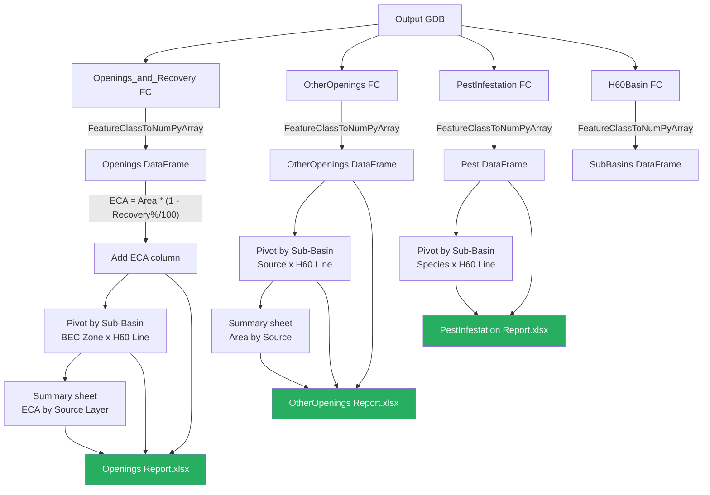

### Three Output Reports

**1. Openings Report** (`{Basin}_{Year}_EstimateECA_Report.xlsx` or `FinalECA`)

| Sheet | Content |
|---|---|
| Summary | Watershed-wide ECA by Source Layer, pivoted by Sub-Basin, with ECA % row |
| {Sub-Basin name} | Per-subbasin pivot: ECA by BEC Zone, Sub-Zone, Source Layer, split into H60 Above/Below columns. Includes H60Basin reference table. |
| Openings Raw Data | Every opening polygon with all attributes: Sub-Basin, Source Layer, BEC Zone, BEC Sub-Zone, H60 Line, Crown Closure, Height, Recovery, Area, ECA, Error |

**2. Other Openings Report** (`{Basin}_{Year}_OtherOpenings_Report.xlsx`)

| Sheet | Content |
|---|---|
| Other Openings Summary | Total area by Source Layer pivoted by Sub-Basin |
| {Sub-Basin name} | Per-subbasin pivot: Area by Source, split into H60 Above/Below |
| Other Openings Raw Data | Every polygon with: Sub-Basin, Source Layer, H60 Line, Area |

**3. Pest Infestation Report** (`{Basin}_{Year}_PestInfestation_Report.xlsx`)

| Sheet | Content |
|---|---|
| {Sub-Basin name} | Per-subbasin pivot: Area by Source, Year, Severity, Species, split into H60 Above/Below |
| Pest Infestation Raw Data | Every polygon with: Sub-Basin, Source, H60 Line, Area, Capture Year, Severity, Species |

### ECA Calculation in Reports

```python
# In convert_feature_classes()
df_open["ECA"] = df_open["Area (ha)"] - (df_open["Recovery %"] / 100 * df_open["Area (ha)"])
```

This is equivalent to: `ECA = Area * (1 - Recovery / 100)`

### Pivot Table Structure

For each sub-basin, the Openings report creates a pivot table like:

```
Example: "Upper Moyie" sub-basin sheet

| BEC Zone | BEC Sub-Zone | Source Layer        | Sub-Basin Area | H60 Above | H60 Below | Total ECA (ha) | ECA % |
|----------|--------------|---------------------|----------------|-----------|-----------|----------------|-------|
| ICH      | mw2          | VRI Openings        | 1250.5         | 12.3      | 5.1       | 17.4           | 1.4%  |
| ICH      | mw2          | Results             | 1250.5         | 8.7       | 2.3       | 11.0           | 0.9%  |
| ESSF     | dcp          | VRI Openings        | 1250.5         | 22.1      | 0.0       | 22.1           | 1.8%  |
| ESSF     | dcp          | Wildfire 20+ Years  | 1250.5         | 15.4      | 0.0       | 15.4           | 1.2%  |

H60 Basin Reference:
| Elevation  | Area (Ha) | % of Total Sub-Basin Area |
|------------|-----------|---------------------------|
| H60 Above  | 950.3     | 76.0%                     |
| H60 Below  | 300.2     | 24.0%                     |
```

### Column Rename Mappings

The reports use human-readable column names:

| Internal Field | Report Column |
|---|---|
| Sub_Basin | Sub-Basin |
| ECAsrc | Source Layer |
| ZONE | BEC Zone |
| SUBZONE | BEC Sub-Zone |
| ELEVATION | H60 Line |
| CROWN_CLOSURE | Crown Closure % |
| PROJ_HEIGHT_1 | Projected Height (m) |
| Recovery | Recovery % |
| Hectares | Area (ha) |
| Error | Calculation Error |

### Excel Formatting

Reports are generated using `pandas.ExcelWriter` with the `xlsxwriter` engine. Key formatting:

- Title rows with 26pt bold centered text
- Excel tables with automatic totals rows
- Number formatting (2 decimal places) for area and percentage columns
- Per-subbasin sheets include conditional formatting (blue background) on the H60Basin reference table
- Summary sheets include formula-based percentage rows: `=COLUMN_TOTAL/basin_area*100`

---

## 14. Output GDB Structure

**Module:** `core/workspace.py`

### Output Geodatabase Feature Classes

| Feature Class | Type | Description | Created By |
|---|---|---|---|
| `Watershed_Boundary` | Polygon | Single dissolved watershed polygon | `watershed.setup_watershed()` |
| `Sub_Basins` | Polygon | Sub-basin polygons with standardized fields | `watershed.setup_subbasins()` |
| `H60_Line` | Polyline | Contour line at the 40th percentile elevation | `dem.draw_contour_line()` |
| `H60Split` | Polygon | Two polygons: H60 Above and H60 Below | `dem.split_h60()` |
| `H60Basin` | Polygon | Union of H60Split and Sub_Basins with area percentages | `other_openings.calc_subbasin_h60()` |
| `Openings` | Polygon | All forest openings (VRI, Results, FTA, wildfire) | `openings.complete_openings()` |
| `Openings_BEC` | Polygon | Openings intersected with BEC zones, with recovery values | `other_openings.setup_curve_layer()` |
| `Openings_and_Recovery` | Polygon | Final openings with recovery and basin area | `other_openings.append_to_recovery_layer()` |
| `OtherOpenings` | Polygon | Roads, natural openings, water, PAS | `other_openings.create_other_openings()` |
| `PestInfestation` | Polygon | Current and historic pest data | `other_openings.create_pest_layer()` |
| `Roads_DRA` | Polyline | DRA major and minor road lines (for reference mapping) | `openings.clip_transport_layers()` |
| `BEC_Zone` | Polygon | BEC zones clipped to watershed | `other_openings.clip_bec_and_field_team()` |
| `Clip_PrivateLands` | Polygon | Private land parcels within watershed | `openings.clip_opening_layers()` |
| `Clip_WildfireTwentyYearsPlus` | Polygon | Historic wildfire areas (20+ years) | `openings.clip_opening_layers()` |
| `Aspect` | Polygon | 8 cardinal direction zones (Final tool only) | `dem.calc_aspect()` |
| `Slope` | Polygon | 6 percent-rise categories (Final tool only) | `dem.calc_slope()` |

### Workspace Lifecycle


| Workspace | Name | Purpose | Lifecycle |
|---|---|---|---|
| **Output GDB** | `ECA_Estimate.gdb` or `ECA_Final.gdb` | Final feature classes for analysis and mapping | Permanent -- kept after tool completes |
| **Scratch GDB** | `EstECAscratch.gdb` or `FinalECAscratch.gdb` | Intermediate processing (clips, merges, splits) | Temporary -- deleted after tool completes |
| **Report Folder** | `EstimateOutputs/` or `Final_Outputs/` | Excel reports and documentation PDFs | Permanent -- contains deliverables |
| **Memory Workspace** | `memory\` (arcpy in-memory) | Very short-lived intermediates (selections, buffers) | Cleared when ArcGIS Pro closes |

### File Naming Convention

```
Output folder structure:
{output_folder}/
  ECA_Estimate.gdb/                   (or ECA_Final.gdb)
  EstimateOutputs/                    (or Final_Outputs/)
    {Basin}_{Year}_EstimateECA_Report.xlsx
    {Basin}_{Year}_OtherOpenings_Report.xlsx
    {Basin}_{Year}_PestInfestation_Report.xlsx
    ECAToolAssumptions.pdf            (copied from network)
    ECAToolInstructions.pdf           (copied from network)
```

---

## 15. Module Reference

### Core Modules Summary

| Module | File | Functions | Purpose |
|---|---|---|---|
| **config** | `core/config.py` | 1 (`get_recovery_params`) | Constants: paths, field names, remap ranges, recovery curves |
| **database** | `core/database.py` | 9 | Spreadsheet loading, SDE validation, layer path resolution, joins |
| **workspace** | `core/workspace.py` | 6 | GDB creation, FC naming constants, scratch management, report paths |
| **watershed** | `core/watershed.py` | 2 | Watershed dissolve, sub-basin standardization |
| **dem** | `core/dem.py` | 8 | DEM clip, percentile, contour, H60 split, aspect, slope |
| **openings** | `core/openings.py` | 7 | Transport clip/buffer/merge, opening clip/merge, complete |
| **other_openings** | `core/other_openings.py` | 9 | Other openings, pest, H60/subbasin splits, BEC intersection, field team |
| **recovery** | `core/recovery.py` | 3 | Recovery curve calculation, application, error checking |
| **reporting** | `core/reporting.py` | 9 | FC-to-DataFrame, pivot tables, Excel export with formatting |
| **utils** | `core/utils.py` | 7 | Append, field ops, area calculation, field mapping |
| **erase_features** | `core/erase_features.py` | 2 | Union-based erase workaround for non-Advanced license |
| **__init__** | `core/__init__.py` | 0 | Package marker |

### Key Function Index

| Function | Module | What It Does (Script) | What It Does (GIS) |
|---|---|---|---|
| `setup_watershed()` | watershed | Dissolves subbasins, validates 1 feature | Creates single watershed boundary |
| `calc_percentile()` | dem | NumPy masked array percentile | Finds the H60 elevation value |
| `split_h60()` | dem | Reclassify DEM, RasterToPolygon, Dissolve | Splits watershed into above/below elevation zones |
| `clip_transport_layers()` | openings | MakeFeatureLayer, SelectByLocation, Clip | Clips road/rail/pipeline data to watershed |
| `buffer_transport()` | openings | Buffer at 4m or 9m half-width | Creates road surface area polygons |
| `merge_vri_results_fta()` | openings | OPENING_ID match, EraseFeatures, Append | Merges three opening data sources without overlap |
| `promote_base_openings()` | openings | Copies the merged base and normalizes fields | Prepares base openings for lower-priority layers |
| `create_other_openings()` | other_openings | Priority-based erase chain | Builds non-forest opening layer |
| `split_by_h60()` | other_openings | Intersect with H60Split | Splits layers into above/below elevation |
| `split_by_subbasin()` | other_openings | Intersect with Sub_Basins | Further splits by drainage unit |
| `setup_curve_layer()` | other_openings | Intersect with BEC, add Field_Team | Prepares openings for recovery calculation |
| `calculate_recovery()` | recovery | 11-param height x crown lookup | Determines % forest recovery |
| `apply_recovery()` | recovery | UpdateCursor over all rows | Applies recovery to every opening polygon |
| `convert_feature_classes()` | reporting | FeatureClassToNumPyArray, DataFrame | Converts GIS data to tabular format |
| `export_reports()` | reporting | pd.ExcelWriter with xlsxwriter | Creates formatted multi-sheet Excel workbooks |

---

## Appendix A: Data Sources

| Layer | Source | SDE Path | Processing Step |
|---|---|---|---|
| VRI Openings & Burns | BCGW | WHSE_FOREST_VEGETATION.VEG_COMP_LYR_R1_POLY | opening |
| Results Forest Cover | BCGW | WHSE_FOREST_VEGETATION.RSLT_FOREST_COVER_INV_SVW | opening |
| RESULTS Openings gap check | BCGW | WHSE_FOREST_VEGETATION.RSLT_OPENING_SVW | opening (recent unmatched remainder only) |
| FTA Pending Blocks | BCGW | WHSE_FOREST_TENURE.FTEN_CUT_BLOCK_POLY_SVW | opening |
| DRA Major Roads | BCGW | WHSE_BASEMAPPING.DRA_DGTL_ROAD_ATLAS_MPAR_SP | transport_18 |
| DRA Minor Roads | BCGW | WHSE_BASEMAPPING.DRA_DGTL_ROAD_ATLAS_MPAR_SP | transport_8 |
| Railways | BCGW | (railway feature class) | transport_18 |
| Pipelines | BCGW | (pipeline feature class) | transport_18 |
| VRI Natural Openings | BCGW | WHSE_FOREST_VEGETATION.VEG_COMP_LYR_R1_POLY | other |
| VRI Water | BCGW | WHSE_FOREST_VEGETATION.VEG_COMP_LYR_R1_POLY | other |
| Results PAS | BCGW | (PAS feature class) | other |
| Private Lands | BCGW | (private lands feature class) | other |
| Wildfire 20+ Years | BCGW | (wildfire perimeter feature class) | other |
| Current Pest Infestation | BCGW | WHSE_FOREST_HEALTH.PEST_INFESTATION_POLY | pest |
| Historic Pest Infestation | BCGW | WHSE_FOREST_HEALTH.PEST_INFESTATION_POLY | pest |
| BEC Zones | BCGW | WHSE_FOREST_VEGETATION.BEC_BIOGEOCLIMATIC_POLY | reference |
| Field Team Boundaries | LOCAL | (local feature class) | reference |
| US/Canada Border | BCGW | (border feature class) | reference |
| TRIM DEM | BCGW | (raster, Use_Condition=default) | DEM |
| SRTM DEM | LOCAL | (raster, Use_Condition=cross_border) | DEM |

## Appendix B: Recovery Curve Tables

### Boundary Field Team

| Zone | h0 | h1 | h2 | h3 | h4 | h5 | cc0 | cc1 | cc2 | cc3 | cc4 |
|---|---|---|---|---|---|---|---|---|---|---|---|
| ICH | 5 | 9 | 11 | 15 | 20 | 25 | 15 | 20 | 30 | 45 | 55 |
| MS | 5 | 8 | 10 | 14 | 18 | 22 | 15 | 20 | 30 | 40 | 50 |
| ESSF dcp | 5 | 7 | 9 | 13 | 16 | 20 | 15 | 20 | 30 | 40 | 50 |
| ESSF mh | 5 | 8 | 10 | 14 | 18 | 23 | 15 | 20 | 30 | 40 | 50 |
| ESSF dc | 5 | 7 | 9 | 12 | 15 | 19 | 15 | 20 | 30 | 40 | 50 |
| ESSF dcw | 5 | 7 | 9 | 11 | 14 | 17 | 15 | 20 | 30 | 35 | 40 |
| IDF | 5 | 9 | 11 | 15 | 19 | 24 | 15 | 20 | 30 | 40 | 50 |
| PP | 5 | 9 | 11 | 15 | 20 | 24 | 15 | 20 | 30 | 40 | 50 |

### Arrow Field Team

| Zone | h0 | h1 | h2 | h3 | h4 | h5 | cc0 | cc1 | cc2 | cc3 | cc4 |
|---|---|---|---|---|---|---|---|---|---|---|---|
| ICH | 5 | 9 | 11 | 16 | 21 | 26 | 15 | 20 | 30 | 40 | 50 |
| ESSF | 4 | 7 | 9 | 13 | 16 | 20 | 15 | 20 | 30 | 35 | 45 |

### Kootenay Lake Field Team

| Zone | h0 | h1 | h2 | h3 | h4 | h5 | cc0 | cc1 | cc2 | cc3 | cc4 |
|---|---|---|---|---|---|---|---|---|---|---|---|
| ICH | 5 | 9 | 11 | 16 | 21 | 26 | 15 | 20 | 30 | 40 | 50 |
| ESSF | 4 | 7 | 9 | 13 | 16 | 20 | 15 | 20 | 30 | 35 | 40 |

### Invermere Field Team

| Zone | h0 | h1 | h2 | h3 | h4 | h5 | cc0 | cc1 | cc2 | cc3 | cc4 |
|---|---|---|---|---|---|---|---|---|---|---|---|
| ICH | 5 | 9 | 11 | 15 | 20 | 25 | 15 | 20 | 30 | 40 | 50 |
| MS | 5 | 9 | 11 | 15 | 20 | 25 | 15 | 20 | 30 | 40 | 50 |
| IDF | 5 | 9 | 11 | 15 | 19 | 24 | 15 | 20 | 30 | 35 | 40 |
| ESSF | 5 | 7 | 9 | 13 | 16 | 20 | 15 | 20 | 30 | 40 | 50 |

### Cranbrook Field Team

| Zone | h0 | h1 | h2 | h3 | h4 | h5 | cc0 | cc1 | cc2 | cc3 | cc4 |
|---|---|---|---|---|---|---|---|---|---|---|---|
| ICH | 5 | 9 | 11 | 15 | 20 | 25 | 15 | 20 | 30 | 45 | 55 |
| MS | 5 | 8 | 10 | 14 | 18 | 23 | 15 | 20 | 30 | 40 | 50 |
| ESSF | 5 | 7 | 9 | 11 | 14 | 17 | 15 | 20 | 30 | 35 | 45 |
| IDF | 5 | 8 | 10 | 14 | 18 | 23 | 15 | 20 | 30 | 40 | 50 |

## Appendix C: Complete Estimate Tool Execution Trace

This traces the exact function calls in `ECAEstimateTool.execute()`:

```
1.  _reload_modules()
2.  database.load_layer_config(xlsx_path)
3.  database.check_db_connections()
4.  database.validate_all_layers(vector_layers, dem_layers, connections)
5.  workspace.create_output_gdb(output_folder, "estimate")
6.  workspace.create_scratch_gdb(output_folder, "estimate")
7.  workspace.create_output_folders(output_folder, "estimate")
8.  watershed.setup_watershed(input_ws, basin_field, output_gdb)
9.  workspace.check_outputs(basin, outputs_dir, "estimate")
10. watershed.setup_subbasins(input_ws, basin_field, subbasin_field, output_gdb)
11. dem.check_border(ws_fc, us_border_path)
12. dem.clip_dem(ws_fc, input_dem, output_folder)
13. dem.calc_percentile(dem_path, output_folder)
14. dem.buffer_watershed(ws_fc)
15. dem.clip_dem(shed_buff, input_dem, output_folder)      # re-clip to buffer
16. dem.draw_contour_line(dem_path, perc_40th, ws_fc, output_gdb)
17. dem.split_h60(ws_fc, dem_path, perc_40th, output_gdb, basin_area)
18. openings.clip_transport_layers(transport_configs, connections, ws_fc, scratch_gdb, output_gdb, joins)
19. openings.buffer_transport(list_list, scratch_gdb)
20. openings.merge_transport(buff_layers, ws_fc, scratch_gdb)
21. openings.clip_opening_layers(opening_configs, connections, ws_fc, scratch_gdb, output_gdb, joins)
22. openings.add_info_fields(scratch_gdb, opening_configs)
23. openings.merge_vri_results_fta(scratch_gdb)
24. openings.promote_base_openings(scratch_gdb)
25. openings.complete_openings(layer_list, scratch_gdb, output_gdb)
26. other_openings.create_other_openings(scratch_gdb, output_gdb)
27. other_openings.create_pest_layer(scratch_gdb, output_gdb)
28. other_openings.clip_bec_and_field_team(bec_path, ft_path, ws_fc, output_gdb)
29. other_openings.select_field_team(scratch_gdb)
30. other_openings.split_by_h60(layer_names, layer_sources, h60_split_fc)
31. other_openings.split_by_subbasin(h60_splits, basin_area, subbasins_fc, output_gdb, scratch_gdb)
32. other_openings.calc_subbasin_h60(output_gdb)
33. other_openings.setup_curve_layer(ft, output_gdb, scratch_gdb)
34. recovery.apply_recovery(openings_bec_fc, has_override=False)
35. recovery.check_and_fix_errors(openings_bec_fc)
36. other_openings.append_to_recovery_layer(openings_bec_fc, basin_area, output_gdb)
37. reporting.convert_feature_classes(output_gdb)
38. reporting.build_subbasin_sheets(data)
39. reporting.build_summary_sheets(data, openings_cols, other_cols)
40. reporting.export_reports(data, output_paths, basin_area, data.get("subbasins"))
41. workspace.cleanup_scratch(scratch_gdb)
```
