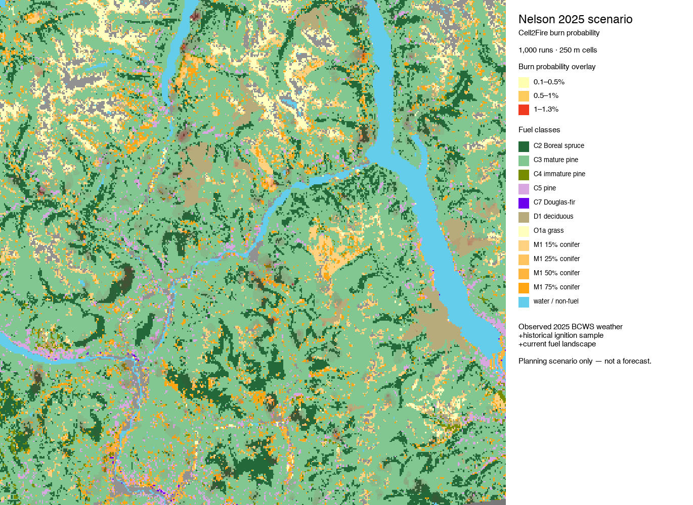

# Nelson, BC wildfire-spread pilot

This repository records a small, reproducible **Cell2Fire** trial for the area around Nelson, British Columbia. It is a conditional spread demonstration, not a wildfire forecast or a burn-probability product.


Orange cells show the final four-hour footprint from one deterministic simulation. The base map is the Canadian Forest Fire Danger Rating System (CFFDRS) fuel-type layer.

## What is included

- A roughly 20 × 25 km, 100 m fuel grid around Nelson, sourced from NRCan's CWFIS FBP fuel-type service.
- A 250 m CWFIS elevation raster and derived slope/aspect surfaces.
- `prepare_nelson_pilot.py`, which converts those rasters to a Cell2Fire input instance.
- `render_nelson_map.py`, which overlays the final burned grid on the fuel map.
- An experimental `Dockerfile.burnp3` and `run-burnp3-console.sh` for eventually running the BurnP3+ / SyncroSim workflow on an x86_64 Linux container.

The Cell2Fire source code, compiled executable, virtual environment, and full result directories are intentionally not committed. Obtain Cell2Fire from its upstream project before rerunning the model.

## Recreate the test

1. Clone [Cell2Fire](https://github.com/cell2fire/Cell2Fire) alongside this repository and install its Python requirements. On Apple Silicon, the included local build used C++14, Homebrew Boost/Eigen, and `libomp`.
2. From this repository root, run `python3 prepare_nelson_pilot.py`. It writes `Cell2Fire/data/nelson-pilot/`.
3. From `Cell2Fire/cell2fire`, run the model:

```bash
python main.py \
  --input-instance-folder ../data/nelson-pilot/ \
  --output-folder ../results/nelson-conditional-test \
  --ignitions --sim-years 1 --nsims 1 --finalGrid \
  --weather rows --nweathers 1 --Fire-Period-Length 1.0 \
  --output-messages --ROS-CV 0.0 --seed 20260716 \
  --grids --combine --verbose
```

4. From this repository root, run `python3 render_nelson_map.py` to recreate the PNG.

## Test assumptions and limitations

The test uses one ignition and deliberately severe **synthetic** four-hour weather (not observed or forecast weather), so the result is only a software/data-pipeline check. It burned 72 cells, about 72 ha at 100 m resolution.

For a defensible burn-probability study, use BCWS/observed weather distributions, realistic historical or scenario ignition locations, calibration, sensitivity checks, and thousands of stochastic iterations. Use results for planning and research—not as operational fire prediction.

## Nelson 2025 weather-conditioned scenario

The repository now also includes a completed 50 km Nelson planning scenario. It uses a 250 m current-fuel landscape, observed 2025 BCWS weather sampled from nearby stations, and sampled 2000–2023 BCWS historical ignition locations. Cell2Fire completed 1,000 independent six-hour simulations.



The resulting cell-level probability surface and run summary are in `long-term/nelson-50km/outputs/`. The maximum estimated cell probability is 1.3%; 15,191 cells were reached in at least one run. This is a **2025-conditioned planning scenario**, not a multi-decade burn-probability study, a live-fire forecast, or an operational decision product.

For reusable simulations in other areas, see [`PIPELINE.md`](PIPELINE.md) and the example configuration [`examples/nelson-50km-2025.json`](examples/nelson-50km-2025.json). The config-driven runner is `fire_sim_pipeline.py`; it keeps each area's Cell2Fire inputs, probability outputs, and web map in separate directories.

The runner also has a local browser GUI: `python3 fire_sim_gui.py` then open `http://127.0.0.1:4180`.

An interactive local web map is in `long-term/nelson-50km/web-map/`. From that directory, serve it and open the shown address:

```bash
python3 -m http.server 4174
# http://127.0.0.1:4174
```

The map has toggleable burn-probability, FBP fuel-type, and historical-ignition layers. Inputs and reproducible build/run scripts are documented in `long-term/nelson-50km/README.md`.

## Interactive web maps

The latest AOI [area of interest] simulation maps are published through GitHub Pages:

<https://axlesholtz.github.io/fire-sim-bc/>

## Data source

Fuel and elevation inputs were obtained from the Canadian Wildland Fire Information System (CWFIS): [CFFDRS FBP fuel-type data](https://open.canada.ca/data/en/dataset/4e66dd2f-5cd0-42fd-b82c-a430044b31de). The elevation layer is resampled from 250 m resolution; slope and aspect therefore support a pilot only.
